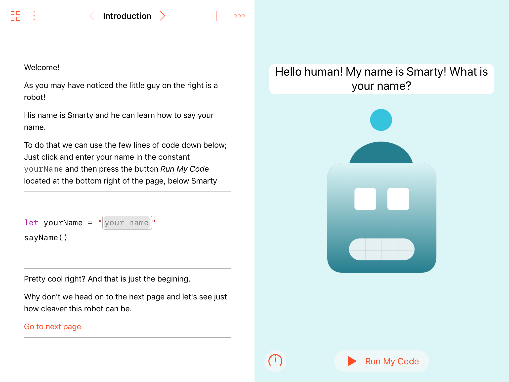
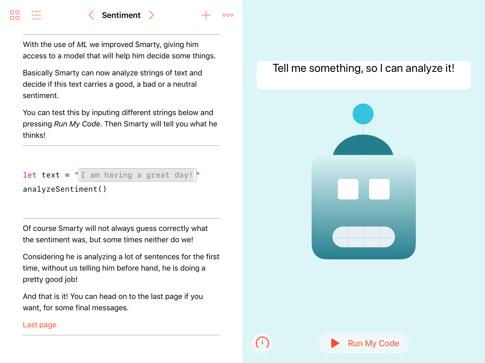
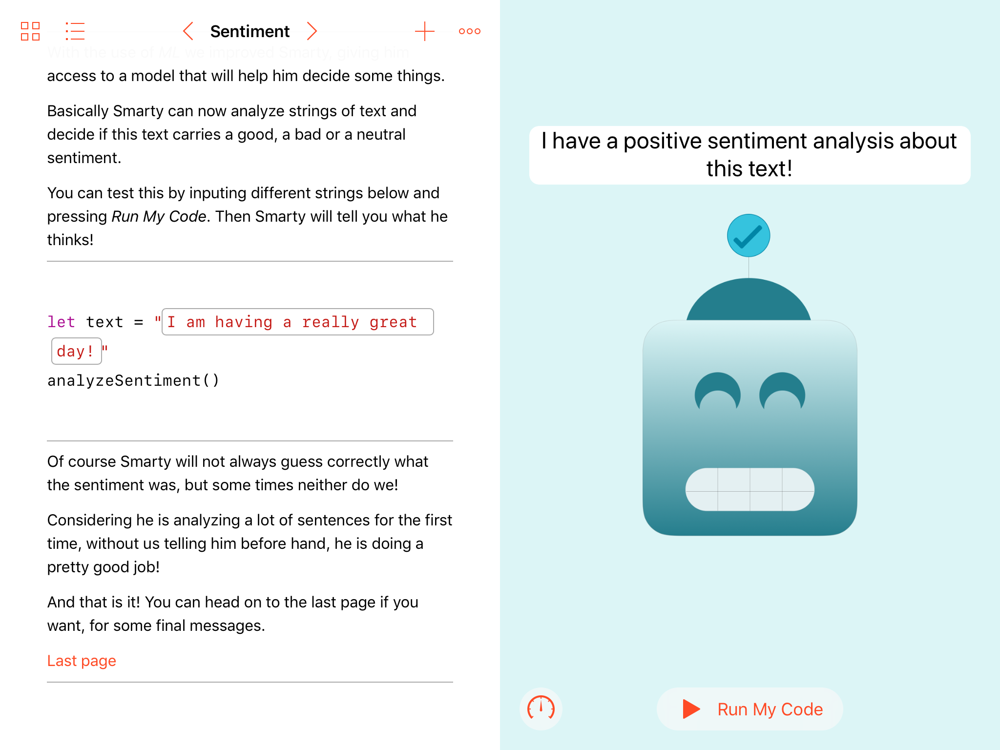
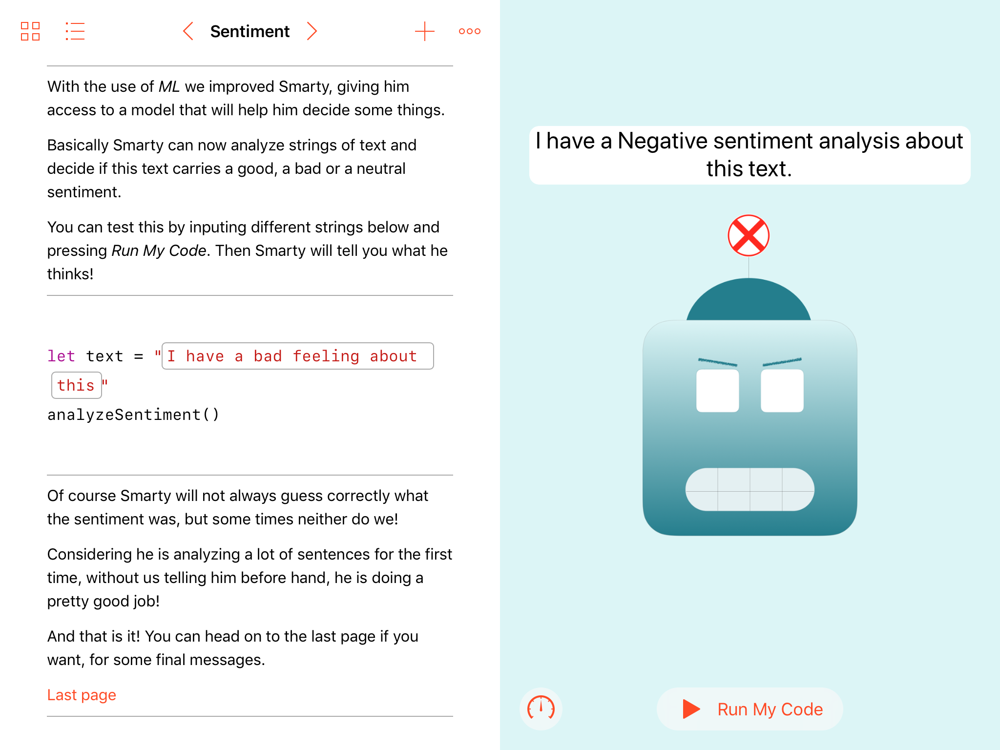
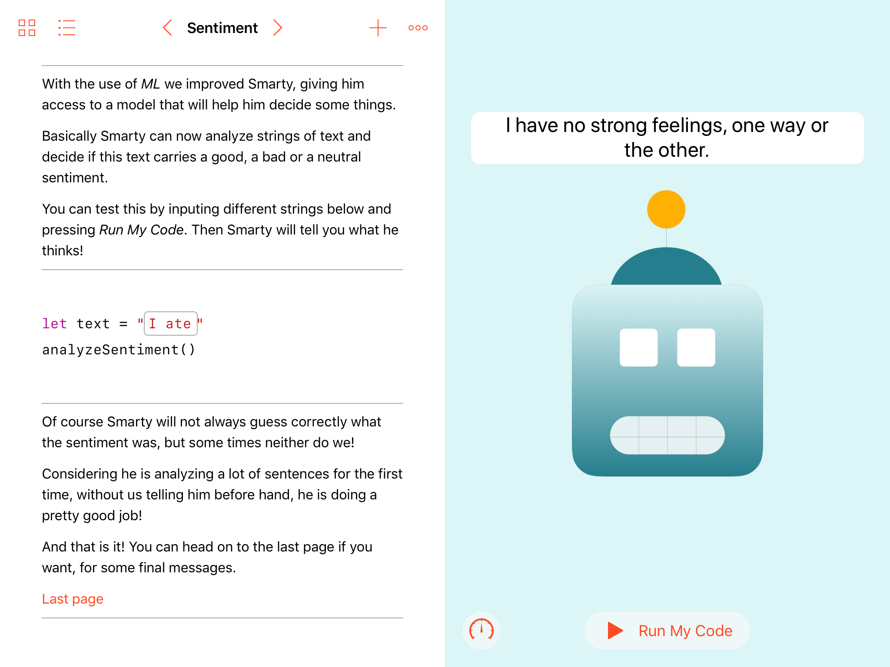

# DiscoveringML

## WWDC 2019 Scholarsip submission

Discovering ML is a `playgroundbook` that tells a little bit about *Machine Learning* in a fun way.

In the book the user interacts with a robot named Smarty

At first Smarty can't do much

But as the book goes on Smarty is able to analyze sentences and discern if it is a good, bad or neutral sentence

Depending on the sentence Smarty will react accordingly

## Run

To run the playgroundbook you will need an iPad with Swift playgrounds installed. Simply open the file `Discovering ML.playgroundbook`.

The book is intented to be used in *Landscape* mode.

## Acknowledgements

The book uses a model named `SentimentPolarity`, authored by [Vadym Markov](https://github.com/vadymmarkov). [This](https://github.com/cocoa-ai/SentimentCoreMLDemo) is the source on github.

 The [background image](https://pixabay.com/vectors/circuit-board-pcb-computer-3773755/) was downloaded from [pixabay](https://pixabay.com).

 All Smarty `faces` were made using [Keynote](https://www.apple.com/lae/keynote/).